# Session 1 - Basic VPC Set-Up

By the end of this session you'll have created the following:
  1. Virtual Private Cloud (VPC) 
  2. 2 x Private Subnets 
  3. 2 x Public Subnets 
  4. Internet Gateway (IGW) 
  5. NAT Gateway (NATGW) 
  6. Route Tables
  7. ALB Security Group 
  8. EC2 Security Group 
  9. IAM Role for your SSM Agent 

  ### Virtual Private Cloud (VPC)
  We're going to create a VPC for our webapp.

  Remember to check your Region, we're going to be choosing __Sydney (ap-southeast-2)__

  1. From the console go to Services > Networking and Content Delivery > VPC (or just search 'VPC' from Services)
  2. From the left, go to Your VPC's > Create VPC
  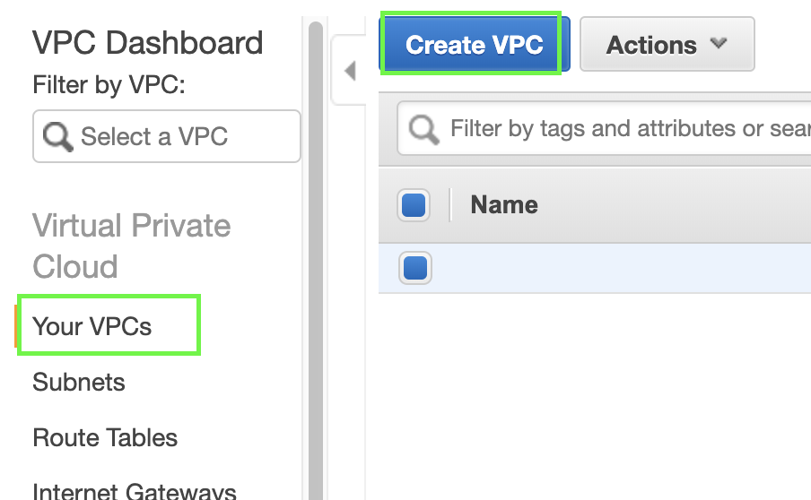
  3. Fill in the fields > Create:
  - Name tag: __cloud-network-security__
  - IPv4 CIDR block: __10.0.0.0/16__

*(The rest are kept as-is)*

  🌈 woo-hoo! You have created your VPC 🌈

When you create a VPC, it also creates the following, which we will need to configure:
- Route Table
- Network ACL
- Security Group

*Your AWS account gets a default VPC. We just need to remember this so we don't choose the wrong VPC in future steps*

### Private and Public Subnets
Now that you have your VPC, let's create public (accessible by the internet) and private (for private data) subnets. It's always 1 subnet for 1 AZ in a VPC.

  1. From the console go to Services > Networking and Content Delivery > VPC > Subnets (or from the left, go to Subnets) > Create Subnet
  2. Choose your VPC from the drop down:
  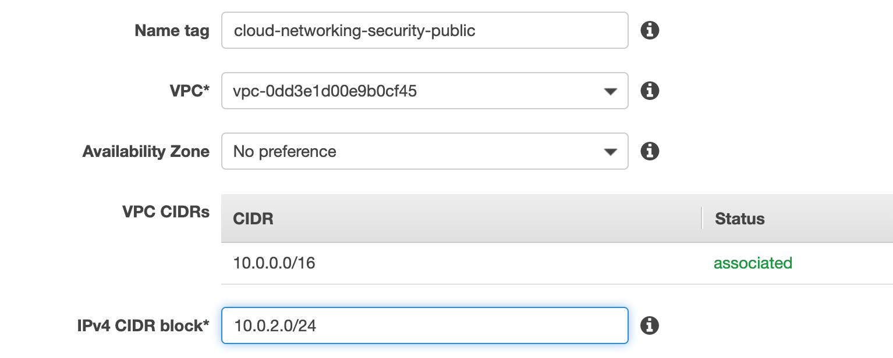
  3. Fill in the fields > Create:
  - Name tag: __cloud-network-network-publicA__
  - IPv4 CIDR block: __10.0.2.0/24__  ( 🧠 Bonus Question: how many IP's are in this subnet?)
  - Availability Zone: __No preference__ 
  *(To stop one availability zone being overloaded, a, b and c AZ's are different for different accounts - otherwise most things would be deployed into AZ-a)*

  🔁 Repeat these steps, changing the fields to 
 -  __cloud-network-network-privateA__ and IPv4 to __10.0.1.0/24__
 -  __cloud-network-network-publicB__ and IPv4 to __10.0.0.0/24__
 - __cloud-network-network-privateB__ and IPv4 to __10.0.3.0/24__

  🌈 woo-hoo! You have created your Public and Private Subnets 🌈

  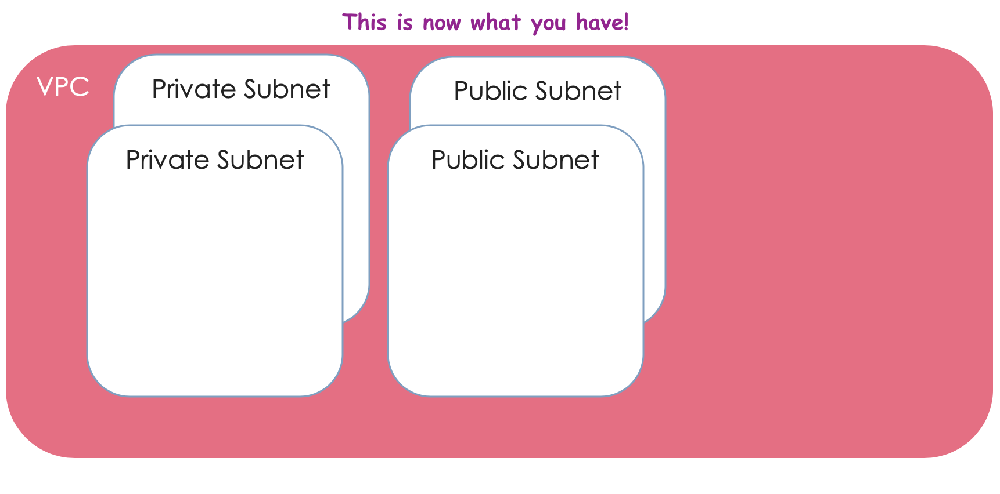

### Internet Gateway (IGW)
Let there be internet! Without an internet gateway, the cool stuff you create isn't accessible from the internet. 

NOTE: The internet gateway is also required to create most AWS resources

1. From the console go to Services > Networking and Content Delivery > VPC > Internet Gateways (or from the left, go to Internet Gateways) > Create Internet Gateway
2. Name tag: __cloud-network-security-igw__
3. Create

  🌈 woo-hoo! You have created your IGW 🌈

...but wait, __detached__ ?

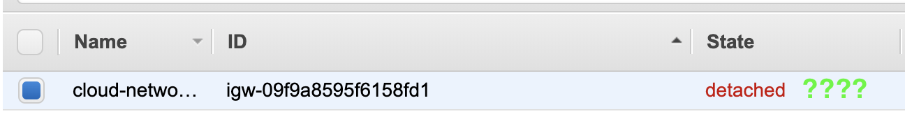

To attach our IGW to our VPC:
1. Select our IGW > Actions > Attach to VPC
2. Choose our __cloud-network-security VPC__
3. Attach

📌 IGW Troubleshooting

Only 1 IGW per VPC - so if you're having issues, make sure your VPC isn't already associated with another IWG. Otherwise, check you haven't accidentally chosen the default VPC; it'll already have its own IGW.

  🌈 woo-hoo! You have attached your IGW to your VPC 🌈

### NAT Gateway (Network Address Translation)

🛑 STOP! Let's take a closer look at NATGWs and Route Tables 🛑

__💵 NAT Gateways Cost Money 💵 So, make sure you delete this resource once done! Cost details: https://aws.amazon.com/vpc/pricing/__

We're creating a NAT Gateway to enable internet access to our __private__ resources without exposing them to the internet.

1. From the console go to Services > VPC > NAT Gateways > Create NAT Gateway

2. Choose your __ONE OF you public subnets__ from the list and Create and EIP ( 🧠 Bonus Questions: what does EIP stand for? Why does our NAT need one?)

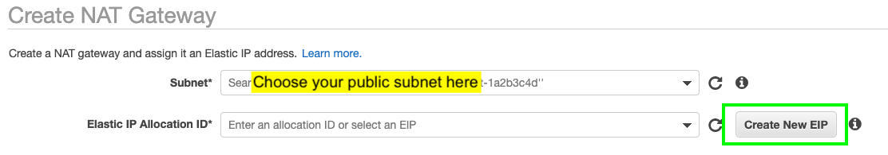

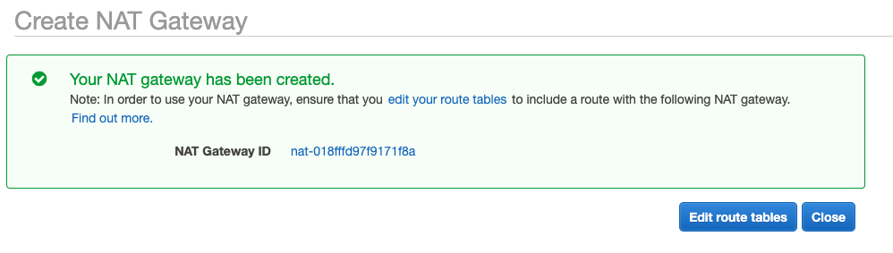

  🌈 woo-hoo! You have created your NAT Gateway  🌈

### Route Tables

Time to configure your route table!

Here are the routes we need to make sure we configure:
- Your Public Subnets route internet traffic via your Internet Gateway *(Public Route Table)*
- Your Private Subnets route internet traffic via your NAT Gateway (which then forwards traffic out the Internet Gateway) *(Main or Default Route Table)*

Configuring your route tables
1. From the console go to Services > Networking and Content Delivery > VPC > Route Tables (or from the left, go to Route Tables) > Create Route Table
2. Name tag: __cloud-network-security-public__ and select our VPC from the dropdown > Create

Now your should have 2 route tables that look like this...

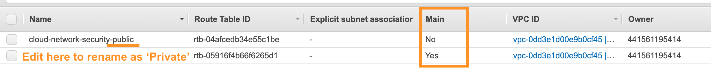

👉🏽 At this point, you can re-name your Main route table to __private route table__

NOTE: Under the 'Main' header, __Yes__ identifies the "main route table", which means anything new defaults to this route table. This means anything to be publicly routeable needs to be explicitly configured this way - this is good!

3. Select your __public route table__ > Edit routes > Add route
4. Fill in the fields: 
  - Destination: 0.0.0.0/0
  - Target: Internet Gateway > cloud-network-security-igw
5. Select your __private route table__ > Edit routes > Add route
6. Fill in the fields: 
  - Destination: 0.0.0.0/0
  - Target: NAT Gateway > __Your NAT Gateway ID__

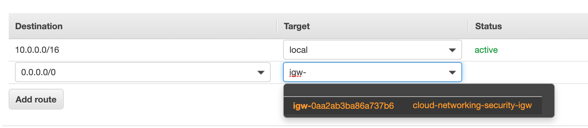

Now let's associate our __Public Subnets__ with our __Public Route Table__

7. Select your public route table > Subnet Associations tab > Edit subnet associations

8. Choose your public subnets > Save

*NOTE: If the AWS UI doesn't allow you to see your subnet names here, you may need to open a separate tab in your browser to get these details 😒*

🔁 Repeat these steps, but it will be your __Private Subnets__ associated with your __Private Route Table__

  🌈 woo-hoo! You have configured your route tables! 🌈

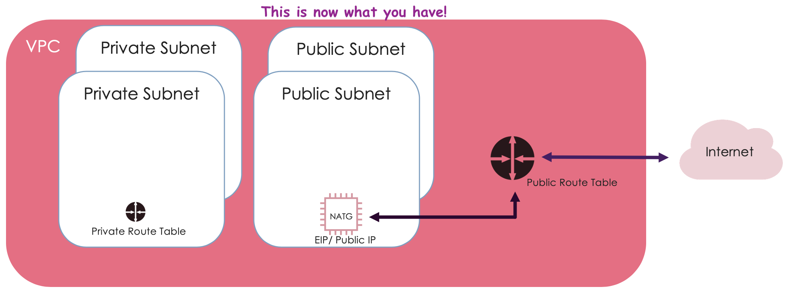

### Security Groups for your Private Web Server and Application Load Balancer

🛑 STOP! Let's take a closer look at Security Groups 🛑

Now that we have our public and private zones of our VPC set up, we need to look at how we pass information securely between them. For example, the load balances will require access to your web servers in the private subnet.

## ALB Security Group
Security Group for a __Public__ ALB
1. From the console go to Services > Networking and Content Delivery > VPC > Security Groups (or from the left, go to Security Groups) > Create Security Group
2. Fill in the fields > Create:

  - Security group name: __alb_securitygroup__
  - Description: __Allows my ALB to talk to the internet__
  - VPC: __cloud-network-security__

3. Create some rules for your new sg for __*Inbound*__:
  - Protocol: HTTPS (Port 443) __AND__ HTTP (Port 80)
  - Source (Custom): 0.0.0.0/0

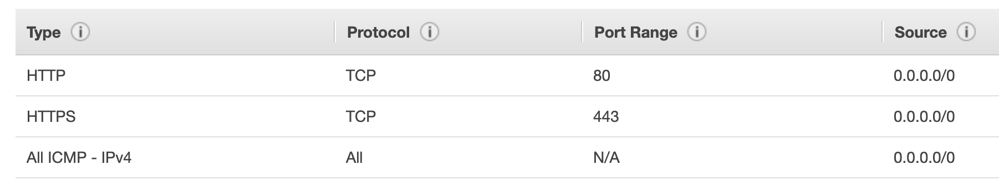

## Web Server Security Group
Security Group for a __Private__ web server
1. From the console go to Services > Networking and Content Delivery > VPC > Security Groups (or from the left, go to Security Groups) > Create Security Group
2. Fill in the fields > Create:

  - Security group name: __ec2_securitygroup__
  - Description: __Allows my ALB to talk to my web private server__
  - VPC: __cloud-network-security__

3. Create some rules for your new sg for __*Inbound*__:
  - Protocol: HTTP (Port 80)
  - Source (Custom): *Your alb-security group*
  
  AND
  - Protocol: All ICMP
  - Source (Custom): *Your Public subnet CIDR's separated by a comma*

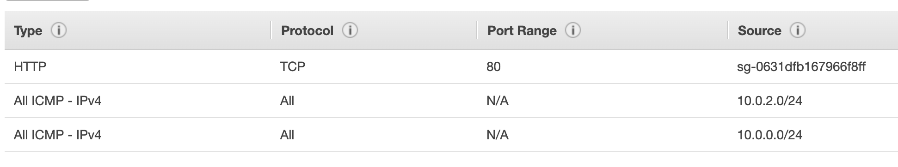

### IAM Role for your SSM Agent

SSM (Session Manager) is a tool that allows us to carry out administrator/sys-admin tasks on servers we're authorized to manage. SSM removes the need to handle any credentials via the command line like __SSH__ does. It is done entirely via the console. So, if you're logged into your AWS console, you have authenticated.

🛑 STOP! Let's do a quick IAM refresher 🛑

We're going to create an IAM role to give us SSM access. SSM will allow us to remotely access your instance.
__NOTE: we'll be using this role when we launch our EC2 instances in the next part__

1. From the Console, go to Services > Security, Identity, & Compliance > IAM 
2. On the left hand side, Click on Roles > Create role
3. Select AWS service, then EC2 as the service that will use this role
   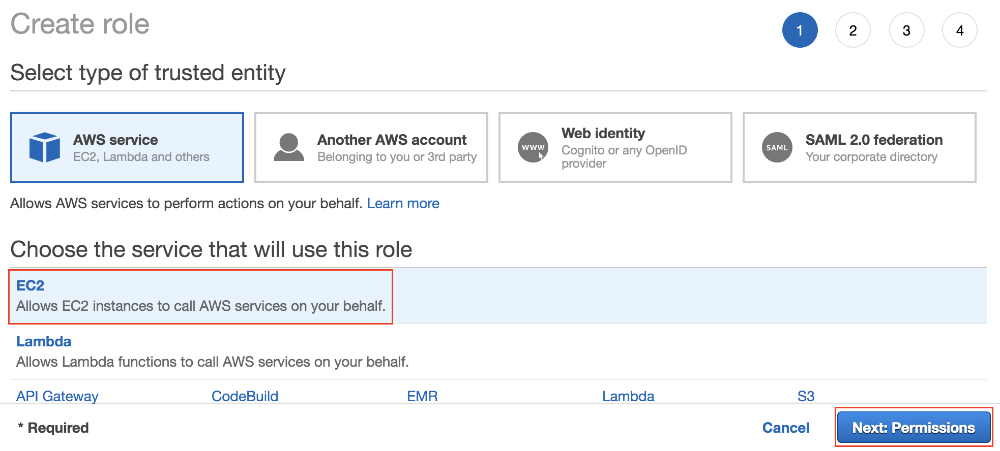
4. Filter the policies by searching for SSM. Select the AWS policy named *AmazonSSMManagedInstanceCore*, then click Next until you reach the review page
   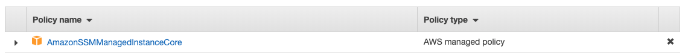

5. Name the role *cloud-network-security-ssm* and check the correct policy was added, then click *Create role*

  🌈 woo-hoo! You have created an IAM role which allows you use SSM to manage your EC2 instances 🌈

### So what have we created?
By now you'll have:
  1. Virtual Private Cloud (VPC) ✅
  2. 2 x Private Subnets ✅
  3. 2 x Public Subnets ✅
  4. Internet Gateway (IGW) ✅
  5. NAT Gateway (NATGW) ✅
  6. Route Tables ✅
  7. ALB Security Group ✅
  8. EC2 Security Group ✅
  9. IAM Role for your SSM Agent ✅

Let's revise what we have created using a network diagram!

TODO
valid uses for NACLs

