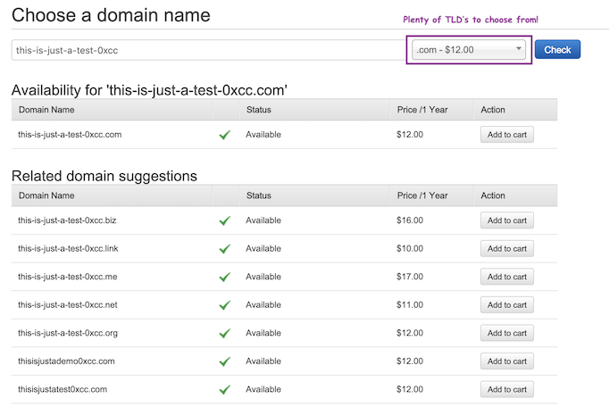
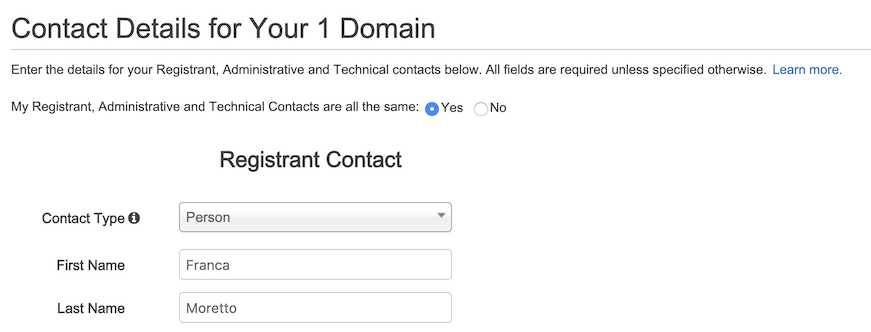

# Route 53
First things first!
- this will cost money (not much)
- you don't have to if you don't want to, you can read through the steps instead

https://docs.aws.amazon.com/Route53/latest/DeveloperGuide/domain-register.html

1. From the console go to Services > Networking and Content Delivery > Route53
  - If you're new to Route 53, under Domain Registration, choose Get Started Now.
  - If you're already using Route 53, in the navigation pane, choose Registered Domains.

2. Choose Register Domain, and specify the domain that you want to register:
  - Enter the domain name that you want to register, and choose Check to find out whether the domain name is available.

  

  - If the domain is available, choose Add to cart. The domain name appears in your shopping cart.
  - In the shopping cart, choose the number of years that you want to register the domain for.

  

  - Choose Continue

3. Enter contact information > Continue

  

4. Go through the following steps:
*(not necessarily in order, so read the screen! 👩🏽‍💻 )*
  - Choose whether you want an auto-renew *(This is up to you if you'd like to keep using it after this course)*
  - Validate your email address
  - Review what you've done
  - Click Complete Purchase

  Easy as 🥧!

  

__NOTE: It can take some time for this to complete, which is why we're not doing anything more until tomorrow__

🛑 Let's take a closer look at Route53 and DNS Takeover 🛑

Further reading for DNS take over!

These are things that helped me understand the topic further, hope they help you too.

[Basics (beginner friendly-ish)](https://0xpatrik.com/subdomain-takeover-basics/)

[Subdomain takeover](https://www.hackerone.com/blog/Guide-Subdomain-Takeovers)

[NS takeover](https://0xpatrik.com/subdomain-takeover-ns/)

[Detailed write-up](https://thehackerblog.com/the-orphaned-internet-taking-over-120k-domains-via-a-dns-vulnerability-in-aws-google-cloud-rackspace-and-digital-ocean/)

