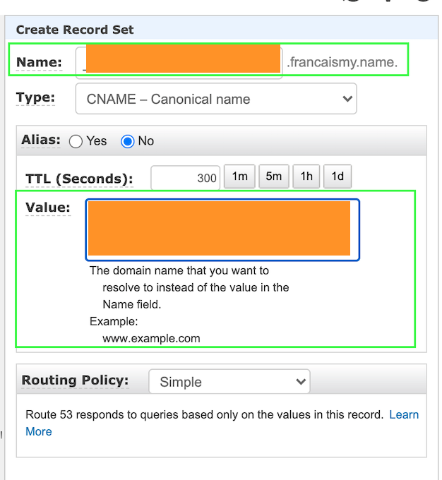

# TLS - AWS Certificate Manager

In this session, you're going to create a certificate to enable HTTPS for your future public endpoint.

🛑 STOP! Let's take a closer look at TLS and AWS Certificate Manager 🛑

1. From the console go to Services > Security, Identity and Compliance > Certificate Manager > Request a Certificate

__NOTE: If this is the first time using the certificate manager, it might look like this...__

2. Choose 'Request a public certificate' > Click 'Request a Certificate'

3. Put in the domain name you'd like a certificate for it can be ....
    - `*.yourwebsite.com` - this will cover any additional subdomains you may create including `www.yourwebsite.com` or `contact-us.yourwebsite.com`
    - `yourwebsite.com` - this will cover your apex zone dns or naked dns
    __NOTE: You can 'Add another name to this certificate' and put both options above if you would like to go on to use this registered domain in the future__

  Click 'Next'

4. Choose 'DNS Validation' as your validation method

  *What does this mean?  💁🏼‍♀️*
  *This is just how Amazon confirms that you have control of this registered domain. The assumption is that if you can make changes to this DNS then you have the rights to also allocate a certificate. Similar to clicking on a validation link in your email when you create a new account with an online service.*
  *Why not use the email validation option? This process takes longer and requires more human-intervention*

5. Open a separate tab in your browser and navigate to your hosted zone for the domain we're working with and follow these steps...
    - Click 'Create Record'
    - Type is a CNAME
    - `Name` and `Value` fields are populated from your Certificate Manager browser tab where you can see the following details:

   - populate in your new CNAME record set like so...
  
  

  - Click 'Create' (you can close this tab now if you like)
  - Go back to your Certificate Manager tab > Next

  🚨 This will have a pending status and may take up to 30mins to be validated 🚨

6. Skip over adding Tags > Review
7. Review the details > Confirm and Request

You might see something like this...

  but as it says below, it can take 30mins!

Eventually it'll look like this! ⏱

__Side Note: If you're moving to an  *infra as code*  mantra, remember that certificates require human validation and it's usually just as easy to use the AWS console__