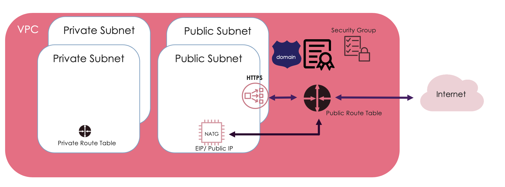
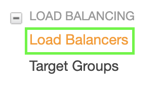
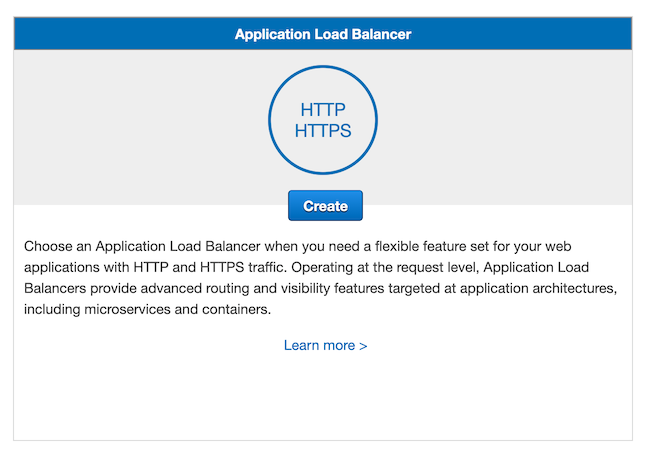
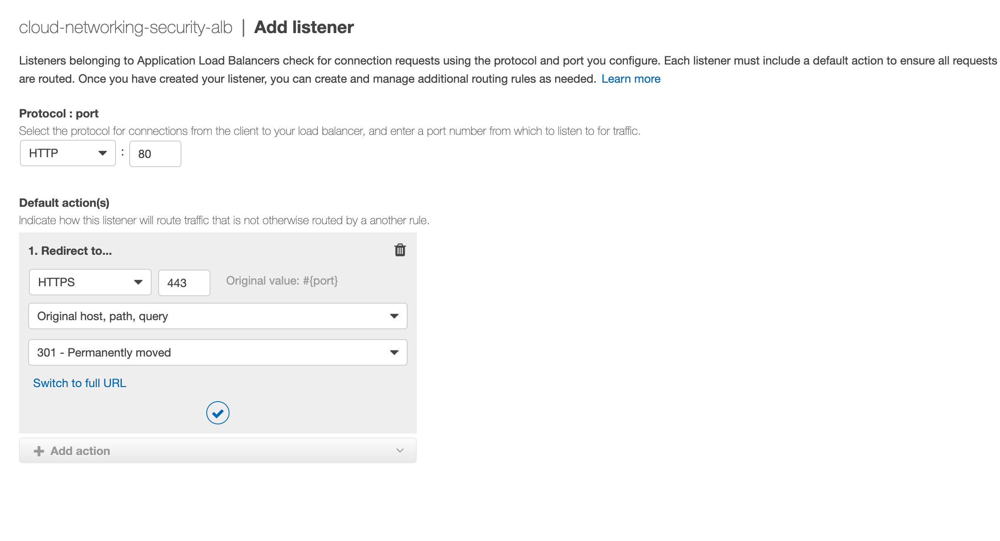
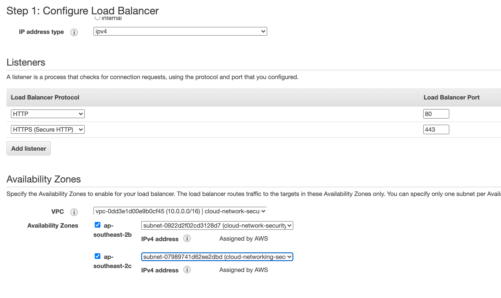
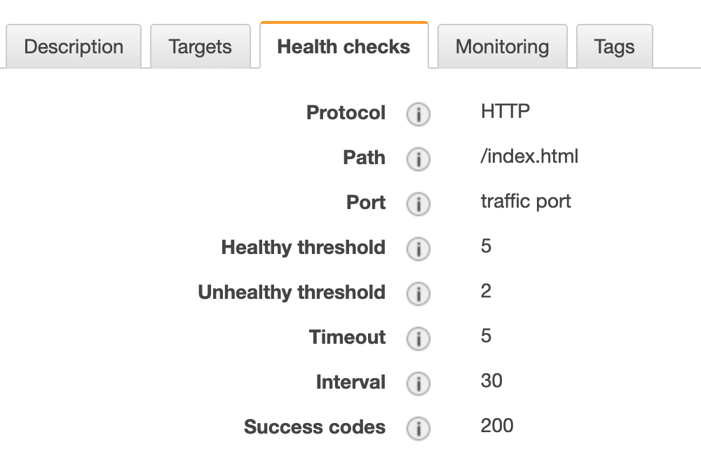
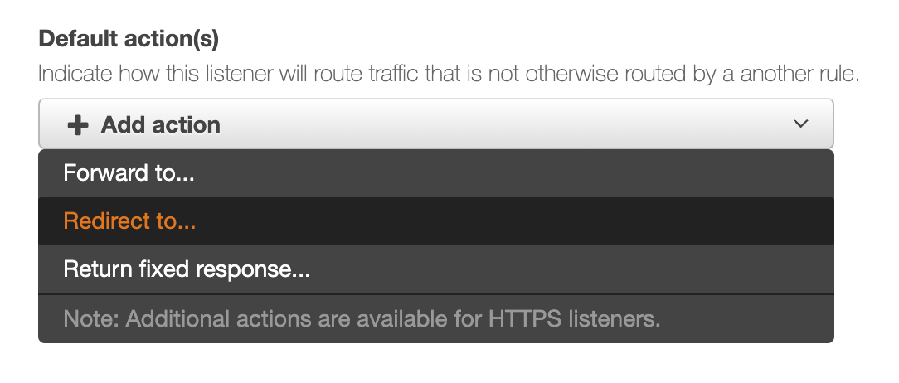
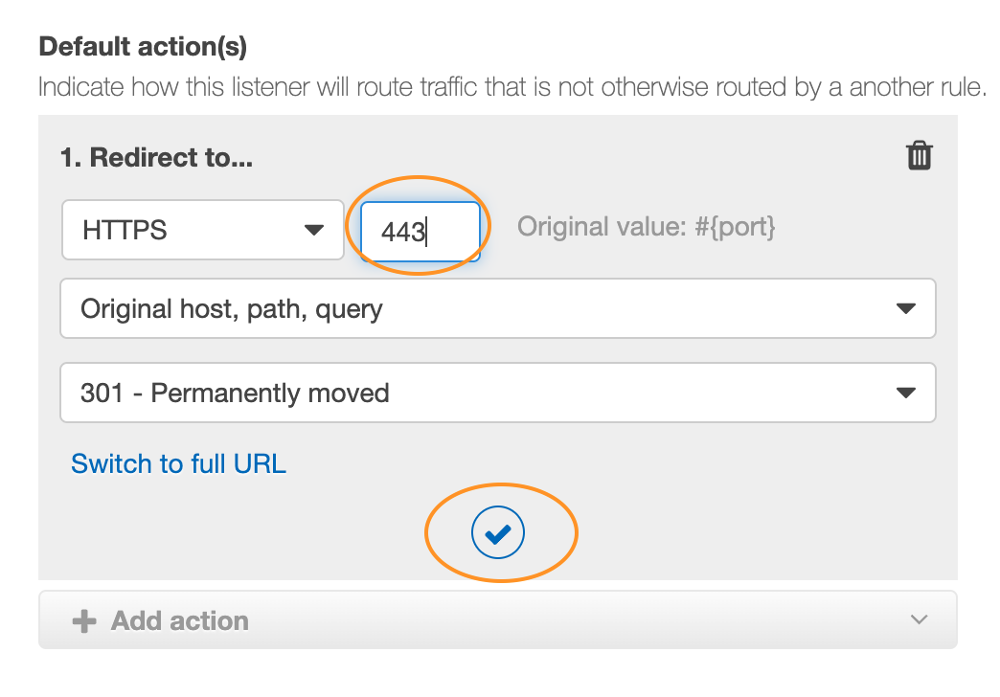
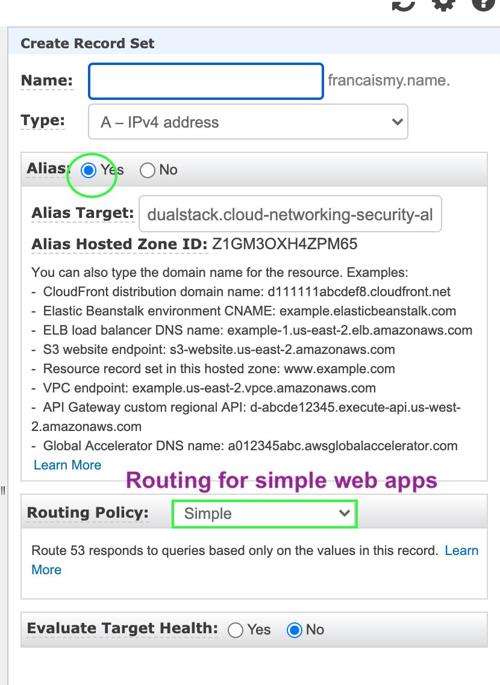

# Load Balancer and ACM
This is a managed AWS service that distributes traffic to targets you specify

There are 3 types:
- ALB - HTTP/S (layer 6)👈🏿 This is what we're going to work with!
- NLB - TCP, UDP (layer 4)
- ELB - Basic load balancing for EC2

### Creating an ALB

1. Services > EC2 > Load Balancers

2. Create Load Balancers

3. Application Load Balancer > Create

- 3.1 Load Balancer Name: __cloud-network-security-ALB__
- 3.2 Scheme: Internet facing

4. Listener Configuration

We want to use HTTPS to ensure that our traffic is secure.

- 4.1 Protocol Port 80 (leave this there, we're going to create a rule that redirects this to HTTPS)
- 4.2 Click 'Add Listener' > HTTPS

5. Availability Zones > Choose your VPC > Add both public subnets

It should look like this!

6. Click ‘Next: Configure Security Settings’

  - 6.1 Choose the certificate you created with ACM
  - 6.2 Choose your Security Policy (TLS 1.2 is a pretty common choice)

7. Click ‘Next: Configure Security Group’

  - 7.1 Pick your ALB security group you created yesterday

8. Click ‘Next: Configure Routing’

  - 8.1 Target Group Name: __cloud-network-security-target-group__
  - 8.2 Target Type: Instance
  - 8.3 Protocol: HTTP (Port 80)
  - 8.4 Health checks protocol: HTTP
        Path: /index.html (we are keeping it simple)

Here's the full Health Check details:

9. Click 'Next: Register Targets' > nothing to do here > Click 'Review and Create'

10. Create

🌈 Woo hoo! You have created your ALB! 🌈

__BUT WAIT!__

Now we need to do some more configuration.....

1. Services > EC2 > Load Balancers
2. Listeners > Select HTTP:80 > Click 'Edit'
3. Click the Delete bin icon and then '+ Add Action'
4. Choose 'Redirect to..' (should default to HTTPS and permanently moved 301)

5. Enter '443' into the Port Field
6. Click the tick icon

7. Click 'Update'

🌈 Now if someone comes to your site via HTTP, your ALB will redirect them to HTTPS. Seamless! 🌈

## Time to associate your ALB with your registered domain

__You'll need your ALB's DNS endpoint, you can get this via the EC2 console > Load Balancers. Can you find it? 🔎__

Then...

1. Route53 > Hosted Zones > your registered domain > create 'Record Set'
2. Name: your domain's apex record or `*.yourdomain`
3. Choose alias as 'Yes' and copy and paste your ALB's DNS
4. Click 'Create'

🌈 Great job, now your registered domain is associated with your ALB's DNS! 🌈
