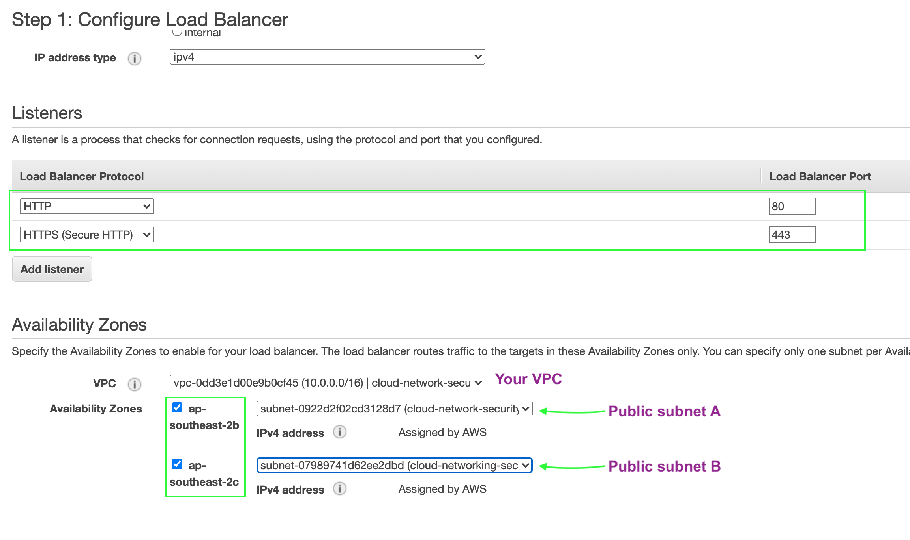

# Load Balancer and ACM
A managed AWS service that distributes traffic to targets you specify

There are 3 types:
- ALB - HTTP/S (layer 6)👈🏿 This is what we're going to work with!
- NLB - TCP, UDP (layer 4)
- ELB - Basic load balancing for EC2

### Creating an ELB

1. Services > EC2 > Load Balancers

2. Create Load Balancers

3. Application Load Balancer > Create

- 3.1 Load Balancer Name: __cloud-network-security-ALB__
- 3.2 Scheme: Internet facing

4. Listener Configuration

Want to use HTTPS to ensure that our traffic is secure. For any public traffic over the internet, your will want to use HTTPS.

- 4.1 Protocol Port 80 (leave this there, we're going to create a rule that redirects this to HTTPS)
- 4.2 Click 'Add Listener' > HTTPS

5. Availability Zones > Choose your VPC > Add both public subnets

Should look like this!

6. Click ‘Next: Configure Security Settings’

  - 6.1 Choose your cert you created with ACM
  - 6.2 Choose your Security Policy (TLS 1.2 is a pretty common choice)

7. Click ‘Next: Configure Security Group’

  - 7.1 Pick your ALB security group you created yesterday

8. Click ‘Next: Configure Routing’

  - 8.1 Target Group Name: __cloud-network-security-target-group__
        Target Type: Instance
        Protocol: HTTP (Port 80)
  - 8.2 Health checks protocol: HTTP
        Path: /index.html (we are keeping it simple)

Here's the full Health Check details:

10. Click 'Next: Register Targets' > nothing to do here > Click 'Review and Create'

11. Create

🌈 Woo hoo! You have created your ALB! 🌈

__BUT WAIT!__

Now we need to do some more configuration.....

1. Services > EC2 > Load Balancers
2. Listeners > Select HTTP:80 > Click 'Edit'
3. Click the Delete bin icon and then '+ Add Action'
4. Choose 'Redirect to..' (should default to HTTPS and permanently moved 301)

5. Enter '443' into the Port Field
6. Click the tick icon

7. Click 'Update'

🌈 Now if someone comes to your site via HTTP, your ALB will redirect them to HTTPS. Seamless! 🌈