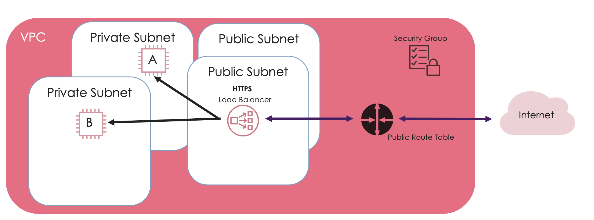
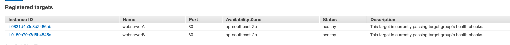
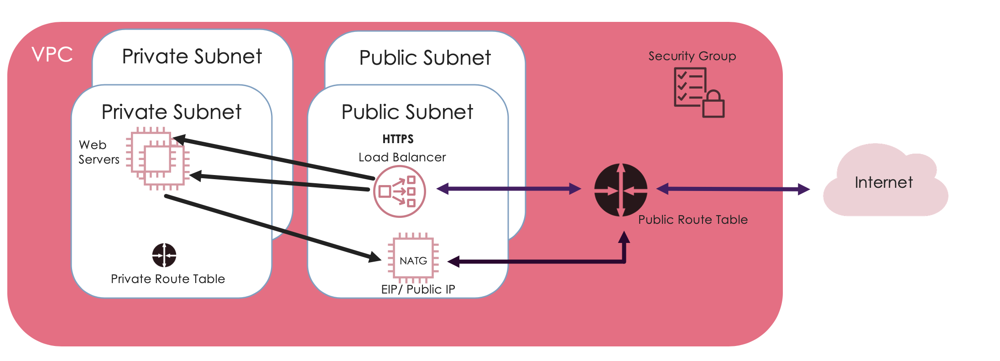

# Deploying Simple Webservers

By the end of this session you'll have:
  1. 2 Webservers (1 in each private subnet)
  2. The ability to test your ALB using Webserver A and B


We're going to deploy 2 webservers, webserver A and webserver B. The intent is that we will be able to hit a public end point and see the load being balanced between the webservers.




### 🚀 Launch two EC2 instances. 1 into each private subnet.
These two instances will be our two web servers

1. Services > Compute > EC2 > Launch Instance
2. Choose *Amazon Linux 2 AMI* > t2.micro
3. Click *Next: Configure Instance Details*
4. Select the __cloud-network-security__ VPC and the associated __privateA__ subnet
5. Assign the IAM role created earlier with SSM permissions
6. Config as webservers:
    - Expand __Advanced Details__
    - Copy and paste the following in the __User Data__ field:
```
#!/bin/bash
yum update -y
yum install httpd -y
service httpd start
chkconfig httpd on
cd /var/www/html
touch index.html
echo '<html><h1>Howdy from Webserver A!</h1></html>' >> index.html
```
7. Click 'Next' until you get to *Configure Security Group* > Select an existing security group
8. Security Group name: __your ec2 webserver sg you created yesterday__ (this is the security group that allows HTTP communication with your ALB)
9.  Review and Launch > Launch
10.  Proceed without key pair > Launch

🔁 Repeat these steps and...

- edit the User Data script with " Howdy from Webserver B!" 👍🏽 (We want to be able to easily tell, which websever we're seeing)
- the 2nd webserver will go into your __privateB__ subnet

🌈 Woo hoo! You have created 2 EC2 Instances configured as webservers! 🌈


Tip: Give each of these instances a name in the EC2 console to make them easier to identify later. You can call them `webserver-A` and `webserver-B` to keep things simple

### Let's test the connectivity of our EC2 Instances

We're going to use SSM to test our webservers. SSM is an agent that allows us to to connect to our EC2s using the Session Manager in the AWS Console.
Why test? This will let us know if the correct route tables have been set up to access resources in our private subnet and the IGW.

1. Services > Management & Governance > Systems Manager
2. Select __Session Manager__ on the left hand side
3. Select __Start Session__
4. Select your __webserverA__ instance from the list of instances
5. A new tab should open with a terminal on your public instance!
6. Type `curl localhost` 

*You should see a response - what is it indicating?*

🌈 Woo hoo! You have tested that your webservers work via SSM! 🌈

<details><summary>📌 Networking Troubleshooting</summary><p>

- Double check your security groups are correct

- Check your instances are deployed into the correct VPC/Subnet

- Double check your route tables are correctly configured
</p></details>

### Let's now test our web servers connect to the internet
1. From the same session that you started above, type `ping 8.8.8.8`
2. You should see a response - what is it indicating?
3. `ctrl + c` to stop the ping

🌈 Woo hoo! You have now confirmed that your two web servers have been correctly set up! 🌈


### Let's now assign our instances to our load balancer!

1. Services > EC2 > Target Groups > Select your target group you created earlier
2. Go to the 'Targets' Tab
3. Edit 
4. Choose the two __private web servers__ from this list

💁🏼‍♀️ It should look something like this:




Now that you have a public endpoint to your load balancer and 2 web servers, we should be able to see the load balancer in action.
Expected behaviour is that as you refresh your end point, you will see a round-robin behaviour between web server A and B.

🌈 Woo hoo! You have 2 web servers, connected to a load balancer and it works! 🌈




You should now have:
  - ✅ 2 EC2's in your __private__ subnet
  - ✅ The ability to test your webservers using ssm
  - ✅ The ability to test your ALB using Webserver A and B
