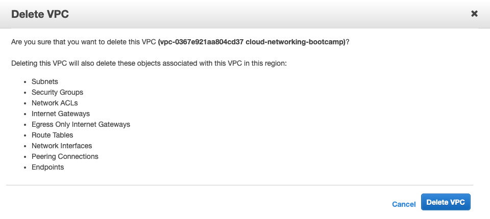

# Clean Up!

## Thanks to AWS, we're giving you all a $50 voucher to apply to you account - this will be more than enough!
Instructions: https://aws.amazon.com/premiumsupport/knowledge-center/add-aws-promotional-code/

## 🚨 __If you don't switch things off, your AWS account will incur a cost__ 🚨

### 👉🏽 'Terminate' your 3 EC2 instances (2 private, 1 public)
Services > EC2 > Instances > Select an EC2 instance > Actions > Instance Status > Terminate

### 👉🏽 Delete your ELB
Services > EC2 > Load Balancers > Select your ELB > Actions > Delete

### 👉🏽 Delete your EIP
Services > EC2 > Elastic IPs > Select your EIP's > Actions > Disassociate EIPs > then you'll have the option to delete

### 👉🏽 Delete your NAT Gateway
Services > VPC > NAT Gateways > Select your NATGW > Actions > Delete NAT Gateway

### 👉🏽 Delete your VPC
Services > VPC > Your VPCs > Select your VPC > Actions > Delete VPC (again Delete VPC)

__NOTE: If your EC2 Instances or NATGW haven't fully delete yet, it will give you an error__

Here's a summary of what deleting your VPC does:

### 👉🏽 Delete IAM Role
Services > IAM > Select the IAM role you created > Delete Role

### 👉🏽 Delete your Registered Domain (or not? Up to you!)
Services > Route53 > Registered Domains > Choose your domain > Click Delete Domain

# Awesome work! 🌈

## It's a good idea to add a Billing Alarm to your personal account
You'll avoid bill shock and be reminded to delete resources that cost money

Instructions: https://docs.aws.amazon.com/AmazonCloudWatch/latest/monitoring/monitor_estimated_charges_with_cloudwatch.html

NOTE: If you've made a least priviledge user, you may need to log in as Root to edit billing settings.
