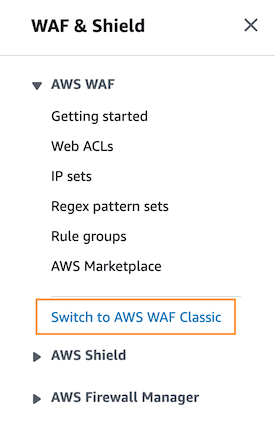

# WAFv2

Just a couple things first...

- There's a 'classic' WAF and a WAFv2
- The newest WAFv2 was released at the end of 2019 and is only available in limited regions
- WAFv2 costs a minimum of $5USD/month
- AWS Managed rules are FREE (but you're limited to how many you can have)

If you have used the WAF before, you may need to...     
`Switch to new AWS WAF` 👈🏿

You are on the correct view if you see this:

### Creating a WAF via the console:

1. Services > Security, Identity & Compliance > WAF & Shield
2. Create web ACL (access control list)
3. Name: __cloud-network-security-wafv2__
4. Resource Type: `Regional resources (Application Load Balancer and API Gateway)`
5. Add AWS Resources > Choose your ALB
6. Click 'Next'

 🛑 Let's take a moment to look at the following AWS documention: 🛑

AWS WAF Managed Rules:
https://docs.aws.amazon.com/waf/latest/developerguide/aws-managed-rule-groups-list.html

7. Add Rules
  - 7.1: Add managed rule groups
  - 7.2: Let's choose `AWS-AWSManagedRulesCommonRuleSet` > Add to web ACL *(Count refers to counting the requests that match this rule, but doesn't block anything)*
  - 7.3 Next and Next again and Next again

8. Review and click 'Create web ACL'

🌈 woo-hoo! You've created a shiny new WAF and attached it to your ALB 🌈

__NOTE: You get a bare bones version of Shield by default and it's free__

Further reading on Shield:
https://docs.aws.amazon.com/waf/latest/developerguide/shield-chapter.html